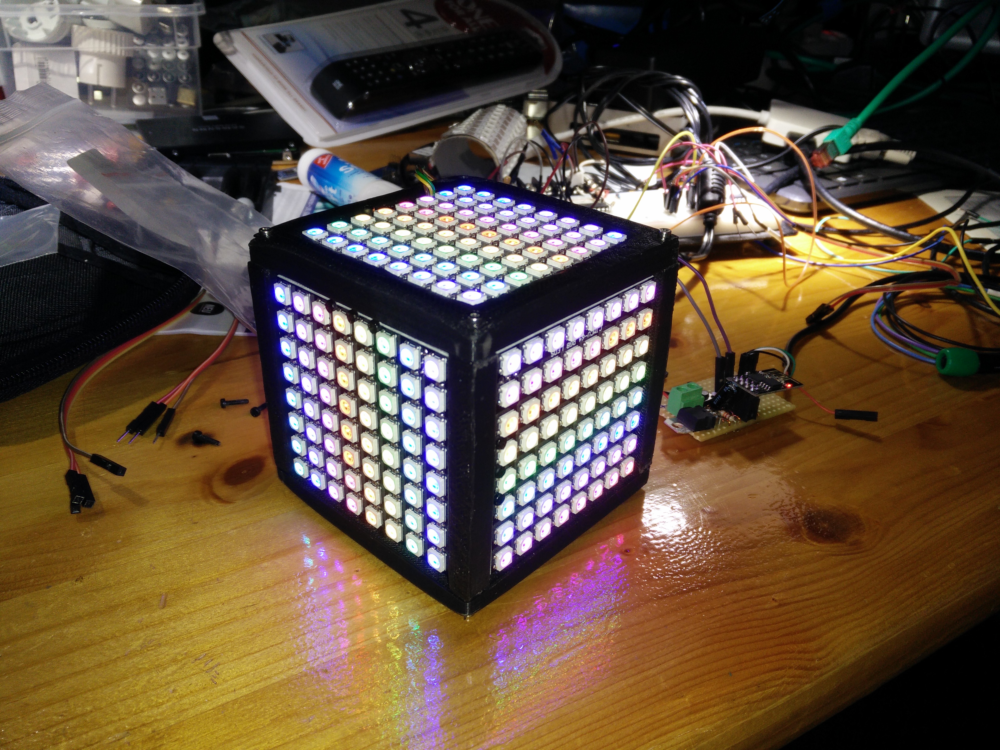

# NeoCube
A cubic NeoPixel model for applications on a finite, un-bounded, 3D shaped 2D plane.

This is an open-source library and open-hardware model of a cubic neo-pixel device for certain research and jet unknown applications.

## The Hardware-Prototype

The model consists of a 3D-printable model, six NeoPixel matrices with 8*8*6 = 384 NeoPixels, a portable power supply, a micro-controller, a 9-axis sensor micro-usb interface and a power button. 

